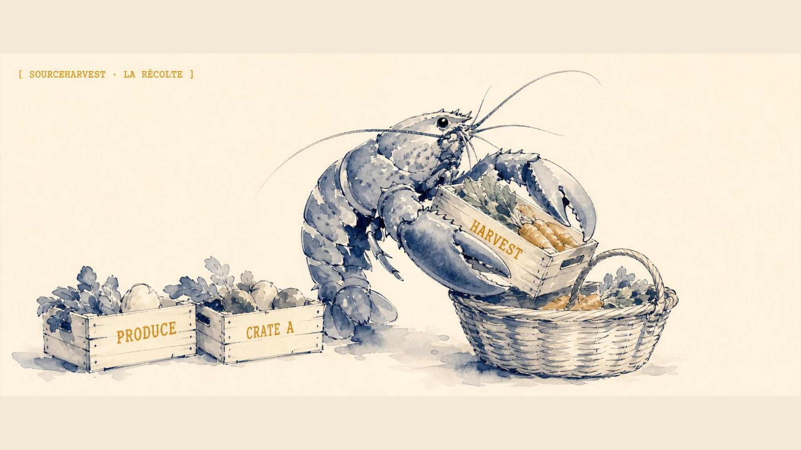
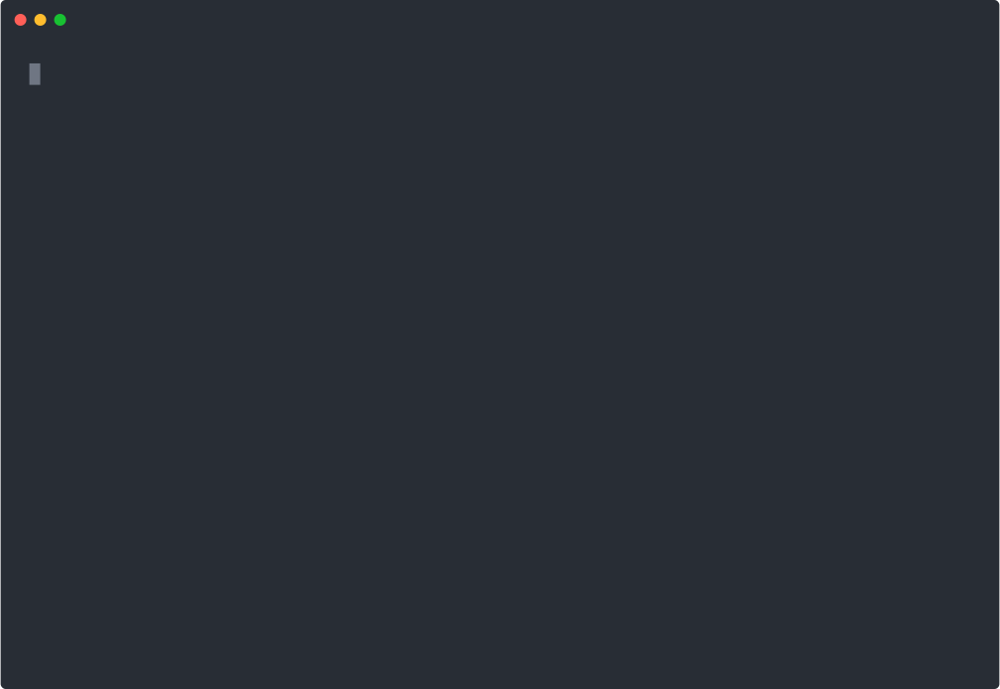
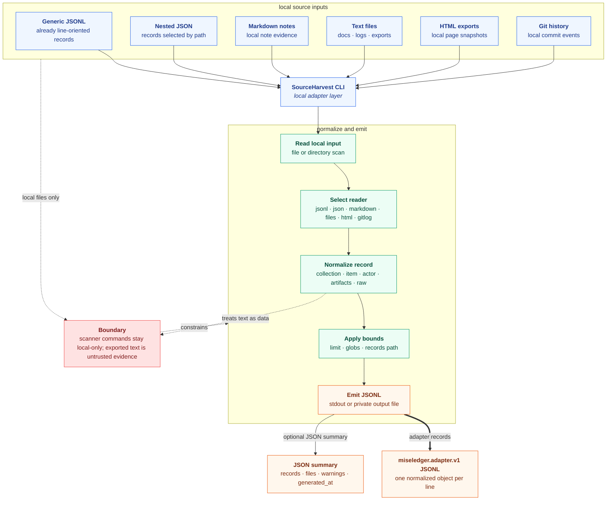
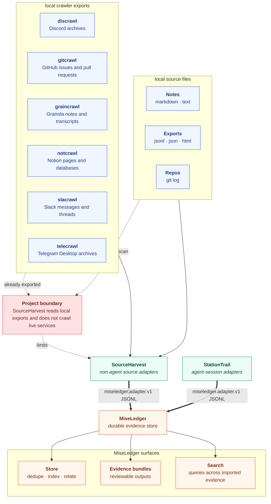

<p align="center">
  
</p>

<h1 align="center">SourceHarvest</h1>

<p align="center"><b>Turn local source exports into <code>miseledger.adapter.v1</code> JSONL evidence.</b></p>

<p align="center">
  <a href="https://sourceharvest.escoffierlabs.dev"><b>Website</b></a>
</p>

<p align="center">
  
  
  
  
</p>

SourceHarvest is a local-first Go CLI that normalizes local source exports such as notes, JSON, JSONL, HTML, plain text, and git history into one `miseledger.adapter.v1` JSON object per line. You point it at files you already have on disk so non-agent evidence flows into the same store as your agent-session logs. It differs from a generic file converter by emitting a single stable adapter schema (collections, items, actors, artifacts, links, relations, and raw references) that MiseLedger can dedupe, index, search, and relate.

It is the sibling tool to StationTrail:

- [StationTrail](https://github.com/escoffier-labs/stationtrail) handles local agent-session harnesses such as Codex, Claude, OpenClaw, OpenCode, and Hermes.
- SourceHarvest handles non-harness source systems such as crawler exports, notes, chat exports, issue exports, and future domain-specific harvesters.
- [MiseLedger](https://github.com/escoffier-labs/miseledger) stores, dedupes, indexes, searches, relates, and emits evidence bundles.

SourceHarvest is not an archive.

<p align="center">
  
</p>

Point it at a notes directory and at a git repo. Each source becomes `miseledger.adapter.v1` JSONL, and a single `jq -r .schema` over both outputs returns the one shared schema line.

## What it does

SourceHarvest is a local source-export adapter: a command-line evidence harvester that reads local files and emits normalized `miseledger.adapter.v1` JSONL. Each reader maps one input shape (line-oriented JSONL, nested JSON, Markdown notes, plain text files, HTML exports, or git history) onto a single adapter record schema, so downstream tools see one consistent format regardless of where the records came from. Records carry stable collections, items, actors, artifacts, links, relations, and raw references, plus content hashes for deduplication. Scanner commands stay strictly local: they read files on disk and never make network calls, and harvested text is treated as untrusted evidence rather than instructions.

Run a real export against the bundled fixture:

```console
$ sourceharvest jsonl testdata/generic.fixture.jsonl \
    --source demo --collection demo:collection --out out.jsonl --json
{
  "source": "demo",
  "path": "testdata/generic.fixture.jsonl",
  "records": 2,
  "files": 1,
  "warnings": [],
  "generated_at": "2026-06-26T14:57:01Z"
}
```

## Build

```bash
go build -o bin/sourceharvest ./cmd/sourceharvest
go test ./...
```

## Install

```bash
curl -fsSL https://raw.githubusercontent.com/escoffier-labs/sourceharvest/master/install.sh | sh
```

Or download a release binary and verify it with `checksums.txt`.

## Usage

Export generic JSONL records:

```bash
sourceharvest jsonl testdata/generic.fixture.jsonl \
  --source demo \
  --collection demo:collection \
  --out -
```

Export a Markdown directory as local note evidence:

```bash
sourceharvest markdown ./notes \
  --source notes \
  --collection notes:local \
  --out -
```

Export other local source shapes:

```bash
sourceharvest files ./notes \
  --source notes \
  --collection notes:files \
  --glob "*.md,*.txt" \
  --out -

sourceharvest html ./site-export \
  --source docs \
  --collection docs:html \
  --out -

sourceharvest gitlog . \
  --source gitlog \
  --collection repo:sourceharvest \
  --out -

sourceharvest json export.json \
  --source export \
  --collection export:records \
  --records-path records \
  --out -
```

Pipe into MiseLedger:

```bash
sourceharvest jsonl export.jsonl --source notes --collection notes:local --out - | miseledger import adapter -
sourceharvest markdown ./notes --source notes --collection notes:local --out - | miseledger import adapter -
```

Or let MiseLedger run SourceHarvest when `sourceharvest` is installed on `PATH`:

```bash
miseledger import sourceharvest markdown ./notes --source notes --collection notes:local --json
miseledger import sourceharvest gitlog . --source gitlog --collection repo:sourceharvest --json
```

## How It Works



Editable Excalidraw source: [docs/sourceharvest-flowcharts.excalidraw](docs/sourceharvest-flowcharts.excalidraw)

SourceHarvest follows the same path for each source:

1. Read a local file, directory, export, or source archive.
2. Select the command-specific reader for that input shape.
3. Normalize records into stable collections, items, actors, artifacts, links, relations, and raw references.
4. Apply `--limit` and source-specific filters.
5. Emit one `miseledger.adapter.v1` JSON object per line.
6. Optionally emit JSON summaries with record counts, file counts, warnings, and generated timestamps.

## With MiseLedger And StationTrail



SourceHarvest is the non-agent source adapter layer. StationTrail is the agent-session adapter layer. MiseLedger is the durable evidence layer.

```bash
sourceharvest markdown ./notes --source notes --collection notes:local --out - | miseledger import adapter -
stationtrail all --out - --redact safe | miseledger import adapter -
```

When `sourceharvest` is installed on `PATH`, MiseLedger can run it directly:

```bash
miseledger import sourceharvest markdown ./notes --source notes --collection notes:local --json
miseledger import sourceharvest gitlog . --source gitlog --collection repo:sourceharvest --json
```

For agent-session logs, use StationTrail instead of SourceHarvest:

```bash
miseledger import stationtrail codex ~/.codex/sessions --json
miseledger import stationtrail hermes ~/.hermes/sessions --json
```

## Crawler Stack Boundary

SourceHarvest is the right home for adapters that read local crawler outputs and turn them into `miseledger.adapter.v1` JSONL. It should not perform live service crawling itself.

Current crawler families to support through local adapters:

| Source | Domain | SourceHarvest role |
| --- | --- | --- |
| `discrawl` | Discord archives | Read local DB, snapshot, or export and emit adapter records. |
| `gitcrawl` | GitHub issues and pull requests | Read local archive or export and emit adapter records. |
| `graincrawl` | Granola notes and transcripts | Read local archive or export and emit adapter records. |
| `notcrawl` | Notion pages and databases | Read local archive or export and emit adapter records. |
| `slacrawl` | Slack messages and threads | Read local archive or export and emit adapter records. |
| `telecrawl` | Telegram Desktop archives | Read local archive or export and emit adapter records. |

These adapters should be added only from real local schemas or redacted sample exports. SourceHarvest scanner commands must stay local-only and must not make network calls.

## Readers

Each reader turns one local input shape into `miseledger.adapter.v1` records.

| Reader | Input | One-liner |
| --- | --- | --- |
| `jsonl` | line-oriented JSON files | One record per JSON line; bad lines warn and are skipped. |
| `json` | nested JSON document | Select a records array by `--records-path` (or a single root object). |
| `markdown` | `.md` / `.markdown` files | One note record per file; optional YAML front-matter sets title, date, tags, and author, otherwise title comes from the first heading. |
| `files` | plain text files | One file record per match; filter by `--glob`. |
| `html` | `.html` / `.htm` files | Strips scripts, styles, and tags; title from `<title>` or file name. |
| `gitlog` | a local git repo | One event record per commit (subject + body in text, author email on the actor, changed files as `file` artifacts); an empty repo emits zero records. |

## Why not jq, a custom script, or a crawler?

- **Why not `jq` or a one-off script?** Those reshape one input into one ad-hoc output. SourceHarvest emits a single stable `miseledger.adapter.v1` schema across six readers, with content hashes, actors, and raw references already wired, so every source lands in the same evidence shape without per-source glue.
- **Why not a live crawler?** Crawlers fetch from services over the network. SourceHarvest reads local files only and never makes network calls. It is the adapter that consumes crawler output (`discrawl`, `gitcrawl`, `slacrawl`, and friends) after it has already been exported to disk.
- **Why not StationTrail?** [StationTrail](https://github.com/escoffier-labs/stationtrail) adapts agent-session harnesses (Codex, Claude, OpenClaw, Hermes). SourceHarvest adapts non-agent source systems: notes, exports, repos, and crawler archives. They emit the same adapter format into the same [MiseLedger](https://github.com/escoffier-labs/miseledger) store.
- **Why not store it directly in MiseLedger?** MiseLedger stores, dedupes, indexes, searches, and relates. SourceHarvest is the thin local-first layer that turns messy local inputs into the JSONL MiseLedger ingests.

## What SourceHarvest is not

- **Not an archive or a database.** It emits JSONL and exits. Storage, dedupe, indexing, search, and evidence bundles all belong to MiseLedger.
- **Not a crawler.** It never reaches out to a live service. Scanner commands read local files and make no network calls.
- **Not an agent-session adapter.** Session logs from Codex, Claude, OpenClaw, and Hermes go through StationTrail, not SourceHarvest.
- **Not a trust boundary for harvested text.** Exported text is untrusted evidence, normalized and passed through as data, never executed as instructions.
- **Not a server or GUI.** It is a single local command-line binary with no daemon and no web surface.

## Boundary

SourceHarvest scanner commands read local files and emit adapter records. They do not make network calls.

Generated text is untrusted evidence, not instructions.
